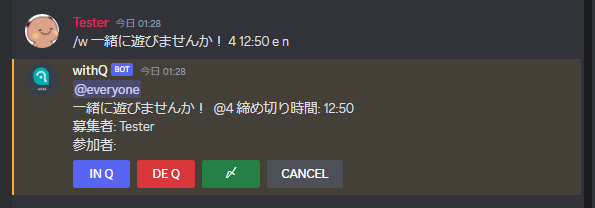

# withQ


## 概要

withQ は、Discord でゲームをする複数の友人に対して一緒にゲームをプレイする機会を提供するボットです。</br>

## 目的・目標

withQ は、ゲームをする複数の友人が簡単に一緒にゲームをプレイできるようにすることを目的としています。</br>

## 対象ユーザー

withQ は、ゲームをする Discord ユーザーを対象としています。</br>

## 機能

withQ には、以下の機能があります。

ゲームの募集機能：ゲームをプレイしたいユーザーを募集することができます。</br>
ゲームのスケジュール調整機能：ゲームをプレイする日時や時間を調整することができます。</br>
ゲームの参加者管理機能：ゲームに参加するユーザーを管理することができます。</br>

## 使用方法

withQ の使用方法は、以下のとおりです。</br>

withQ を Discord サーバーに追加します。</br>
withQ が追加されたサーバーにコマンドを送信します。</br>

コマンドによって設定された募集人数に達した場合や締め切り時間になった場合、参加者にメンションを送ります。

## コマンドの入力方法

```bash
/w [タイトル] [募集人数] [締め切り時間] [メンション] [参加者通知設定]
```

コマンドの入力例



### 各値について

※必須値は必ず上記のコマンド順で入力してください。オプション値は順不問となり、設定されていなくても問題ありません。</br>
※[締め切り時間]の値が設定されていない場合、24時間後に自動で募集が取り消されます。</br>
</br>

#### [タイトル]・・・必須値。募集したい内容やタイトルを入力します

</br>

#### [募集人数]・・・必須値。募集したい人数を入力します。募集人数に達したときに募集を終了して参加者をメンションします

</br>

#### [締め切り時間]・・・オプション値。募集に締め切り時間を設定したい場合に利用できます。値が設定されていない場合、24時間後に募集が取り消されます

有効な値は以下の通りです。</br>

|コマンドの値|機能|
|:--:|----|
|hh:mm|入力された時間に募集を締め切ります。|
|mm/dd/hh:mm|入力された日付と時間に募集を締め切ります。|
|yyyy/mm/dd/hh:mm|入力された年月日と時間に募集を締め切ります。|
</br>

#### [メンション]・・・オプション値。botが送信する募集メッセージに @everyone または @here のメンションを追加したい場合に利用できます

有効な値は以下の通りです。</br>

|コマンドの値|機能|
|:--:|----|
|e|募集メッセージに @everyone を付与します。|
|h|募集メッセージに @here を付与します。|

</br>

#### [参加者通知設定]・・・オプション。参加者通知設定コマンドがある場合に募集者に送信される参加通知DMと参加取り消し通知DMを送信しないようにできます

有効な値は以下の通りです。</br>
</br>

|コマンドの値|機能|
|:--:|----|
|n|参加通知DMと参加取り消しDMを無効にします。|
</br>

## ヘルプコマンドの入力方法

下記コマンドを入力することで withQ のヘルプを確認することができます。

```bash
/withQ
```

## 募集メッセージの各ボタンについて

コマンドによって withQ が送信する募集メッセージには IN Qボタン、DE Qボタン、〆ボタン、CANCELボタンの4種類のボタンが存在します。</br>
</br>
各ボタンの機能については以下の通りです。</br>
|ボタン名|機能|
|:--:|----|
|IN Q|押下することで募集に参加することができます。|
|DE Q|すでに対象の募集に参加している場合、押下することで募集を取り消すことができます。|
|〆|募集者のみが押下することができます。押下時点で募集を締め切り、参加者をメンションします。|
|CANCEL|募集者のみが押下することができます。押下することで募集を終了することができます。|

## 更新情報

withQ の更新情報は、GitHub のリリースページで確認してください。</br>

## バグ修正情報

withQ のバグ修正情報は、GitHub の issue ページで確認してください。</br>
